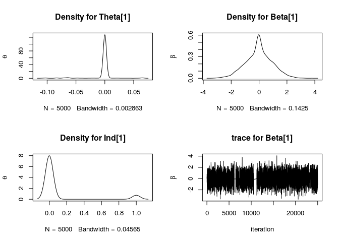
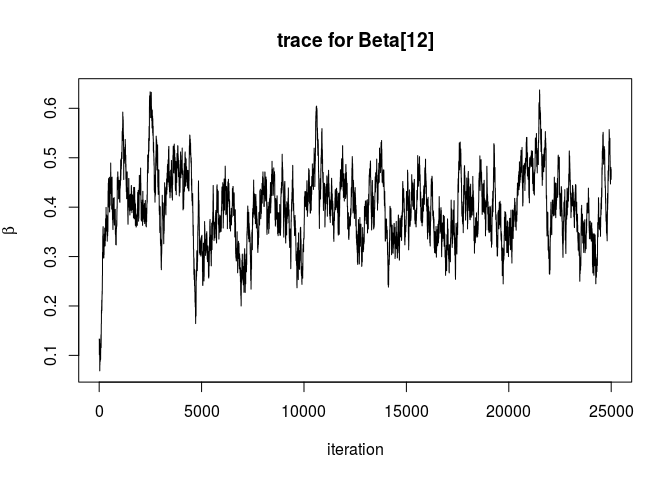

Example solution
================

The most direct approach to variable selection is to set the slab, *θ*<sub>*j*</sub>|(*I*<sub>*j*</sub> = 1) equal to *β*<sub>*j*</sub> and spike *θ*<sub>*j*</sub>|(*I*<sub>*j*</sub> = 0) equal to zero. A simple example solution using the Kuo and Mallick method sets *θ*<sub>*j*</sub> = *I*<sub>*j*</sub>*β*<sub>*j*</sub> which assumes independence *P*(*I*<sub>*j*</sub>, *β*<sub>*j*</sub>)=*P*(*I*<sub>*j*</sub>)*P*(*β*<sub>*j*</sub>).

Nimble package
--------------

For a quick solution, the nimble package is used to implement variable selection algorithms. The package allows statistical models to be written in BUGS form, built in R but compiles using C++ for speed. The package allows the user to implement their own samplers.

Kuo-Mallick
-----------

Using the package nimble:

``` r
library(nimble)
dataset <- read.csv("../simulated_data.csv")
n <- 200; p <- 20
y <- dataset[,1]
x <- as.matrix(dataset[,-1])

# Set MCMC parameters
M.burnin <- 10000
M <- 5000
n.thin <- 5

myBUGScode <- nimbleCode({
  Pind <- 0.5
  alpha ~ dnorm(log(10),1)             # Intercept 
  tau ~ dgamma(1.0E-4,1.0E-4)          # precision param
  for(j in 1:p) {
    Ind[j] ~ dbern(Pind)               # Indicator
    beta[j] ~ dnorm(0,1)               # Conditional Regression coefficient
    theta[j] <- Ind[j]*beta[j]
  }
  for(i in 1:n) {
    er[i] ~ dnorm(0, tau)
    mu[i] <- alpha + inprod(theta[], X[i,]) + er[i]
    lambda[i] <- exp(mu[i])
    y[i] ~ dpois(lambda[i])          # Likelihood 
  }
})
```

For nimble, define the constants and dimensions, parse in model.

``` r
constants <- list(n = n, p=p)
dimensions = list(beta = p,
                  theta = p,
                  Ind =  p,
                  lambda =  n,
                  X = c(n,p),
                  er = n,
                  mu = n)
myModel <- nimbleModel(myBUGScode, 
                       constants = constants, 
                       dimensions = dimensions)
```

Give the model the data, initial values and build the MCMC.

``` r
myModel$setData(
  list(y = dataset[,1], X = as.matrix(dataset[,-1]))
  )

myModel$setInits(
  list(alpha=1, tau = 0.5, beta = matrix(0,nrow = 1, ncol = p), er = rnorm(n,0,1))
  )

myMCMC <- buildMCMC(myModel)
```

Using Nimble, compute the mcmc and plot the thinned samples:

``` r
compiled <- compileNimble(myModel, myMCMC)

compiled$myMCMC$run(M.burnin + M*n.thin)
```

    ## |-------------|-------------|-------------|-------------|
    ## |-------------------------------------------------------|

    ## NULL

``` r
samples <- as.matrix(compiled$myMCMC$mvSamples)

thinnedsample <- samples[M.burnin + seq(from = 1,by = n.thin, 
                             to = M*n.thin),]
```

### Plots and analysis

Plot Density of coefficients for *θ*<sub>1</sub> values.

``` r
par(mfrow=c(2,2))
plot(density(thinnedsample[,"beta[1]"]*thinnedsample[,"Ind[1]"]), ylab = expression(theta), main = "Density for Theta[1]")
plot(density(thinnedsample[,"beta[1]"]), ylab = expression(beta), main = "Density for Beta[1]")
plot(density(thinnedsample[,"Ind[1]"]), ylab = expression(theta), main = "Density for Ind[1]")
plot(samples[-c(1:M.burnin),"beta[1]"],  type = 'l', xlab = 'iteration',  ylab = expression(beta), main = "trace for Beta[1]")
```



``` r
par(mfrow=c(1,1))
```

The *θ*<sub>1</sub> parameter is strongly concentrated at zero, trace plots for beta show convergence for the beta parameter and density for *I*<sub>1</sub> also indicate evidence that this variable does not contribute much to the regression. The true value for *θ*<sub>1</sub> = 0.02857143 which is very small, the posterior mean estimate is -0.002378.

Traceplots show some potential issues for parameters, eg *θ*<sub>12</sub> with trace plot:

``` r
plot(samples[-c(1:M.burnin),"beta[12]"],  type = 'l', xlab = 'iteration',  ylab = expression(beta), main = "trace for Beta[12]")
```



Using the skimr package to see posterior summary results:

    ## 
    ## Attaching package: 'skimr'

    ## The following object is masked from 'package:knitr':
    ## 
    ##     kable

    ## Skim summary statistics  
    ##  n obs: 5000    
    ##  n variables: 40    
    ## 
    ## Variable type: numeric
    ## 
    ## variable   n      mean        sd        p0         p25     p50     p75      p100     hist     
    ## ---------  -----  ----------  --------  ---------  ------  ------  -------  -------  ---------
    ## beta_01    5000   -0.00238    0.0175    -0.108     0       0       0        0.0665   ▁▁▁▁▇▁▁▁ 
    ## beta_02    5000   -0.000131   0.0085    -0.0634    0       0       0        0.0763   ▁▁▁▇▁▁▁▁ 
    ## beta_03    5000   0.0395      0.0599    -0.0352    0       0       0.0776   0.217    ▁▇▁▂▁▁▁▁ 
    ## beta_04    5000   3e-04       0.00929   -0.0546    0       0       0        0.056    ▁▁▁▇▁▁▁▁ 
    ## beta_05    5000   0.000176    0.004     -0.0419    0       0       0        0.0413   ▁▁▁▁▇▁▁▁ 
    ## beta_06    5000   0.0148      0.038     -0.0436    0       0       0        0.155    ▁▇▁▁▁▁▁▁ 
    ## beta_07    5000   0.234       0.0823    -0.00623   0.186   0.237   0.288    0.459    ▁▁▃▇▇▅▂▁ 
    ## beta_08    5000   0.285       0.0667    0.0793     0.24    0.286   0.325    0.519    ▁▂▅▇▇▂▁▁ 
    ## beta_09    5000   0.184       0.105     -0.00866   0.12    0.212   0.263    0.401    ▆▂▂▅▇▆▃▁ 
    ## beta_10    5000   0.335       0.0653    0.108      0.29    0.337   0.379    0.557    ▁▁▃▇▇▃▁▁ 
    ## beta_11    5000   0.384       0.0579    0.186      0.343   0.386   0.427    0.565    ▁▁▃▇▇▆▂▁ 
    ## beta_12    5000   0.399       0.0704    0.0805     0.354   0.398   0.445    0.626    ▁▁▁▅▇▆▂▁ 
    ## beta_13    5000   0.398       0.0635    0.185      0.354   0.395   0.441    0.659    ▁▂▅▇▆▂▁▁ 
    ## beta_14    5000   0.372       0.0735    0.0919     0.326   0.373   0.419    0.595    ▁▁▂▆▇▅▂▁ 
    ## beta_15    5000   0.432       0.0631    0.214      0.39    0.434   0.475    0.65     ▁▁▃▇▇▅▁▁ 
    ## beta_16    5000   0.515       0.0666    0.31       0.472   0.517   0.564    0.709    ▁▂▃▇▇▆▂▁ 
    ## beta_17    5000   0.52        0.0674    0.301      0.478   0.517   0.56     0.821    ▁▁▆▇▃▁▁▁ 
    ## beta_18    5000   0.52        0.0722    0.256      0.47    0.515   0.569    0.774    ▁▁▃▇▇▃▁▁ 
    ## beta_19    5000   0.518       0.0637    0.282      0.474   0.517   0.559    0.731    ▁▁▂▇▇▅▁▁ 
    ## beta_20    5000   0.49        0.0742    0.221      0.441   0.491   0.539    0.7      ▁▁▂▆▇▅▂▁ 
    ## Ind_01     5000   0.0848      0.279     0          0       0       0        1        ▇▁▁▁▁▁▁▁ 
    ## Ind_02     5000   0.049       0.216     0          0       0       0        1        ▇▁▁▁▁▁▁▁ 
    ## Ind_03     5000   0.382       0.486     0          0       0       1        1        ▇▁▁▁▁▁▁▅ 
    ## Ind_04     5000   0.0536      0.225     0          0       0       0        1        ▇▁▁▁▁▁▁▁ 
    ## Ind_05     5000   0.0354      0.185     0          0       0       0        1        ▇▁▁▁▁▁▁▁ 
    ## Ind_06     5000   0.19        0.392     0          0       0       0        1        ▇▁▁▁▁▁▁▂ 
    ## Ind_07     5000   0.985       0.122     0          1       1       1        1        ▁▁▁▁▁▁▁▇ 
    ## Ind_08     5000   1           0         1          1       1       1        1        ▁▁▁▇▁▁▁▁ 
    ## Ind_09     5000   0.829       0.377     0          1       1       1        1        ▂▁▁▁▁▁▁▇ 
    ## Ind_10     5000   1           0         1          1       1       1        1        ▁▁▁▇▁▁▁▁ 
    ## Ind_11     5000   1           0         1          1       1       1        1        ▁▁▁▇▁▁▁▁ 
    ## Ind_12     5000   1           0         1          1       1       1        1        ▁▁▁▇▁▁▁▁ 
    ## Ind_13     5000   1           0         1          1       1       1        1        ▁▁▁▇▁▁▁▁ 
    ## Ind_14     5000   1           0         1          1       1       1        1        ▁▁▁▇▁▁▁▁ 
    ## Ind_15     5000   1           0         1          1       1       1        1        ▁▁▁▇▁▁▁▁ 
    ## Ind_16     5000   1           0         1          1       1       1        1        ▁▁▁▇▁▁▁▁ 
    ## Ind_17     5000   1           0         1          1       1       1        1        ▁▁▁▇▁▁▁▁ 
    ## Ind_18     5000   1           0         1          1       1       1        1        ▁▁▁▇▁▁▁▁ 
    ## Ind_19     5000   1           0         1          1       1       1        1        ▁▁▁▇▁▁▁▁ 
    ## Ind_20     5000   1           0         1          1       1       1        1        ▁▁▁▇▁▁▁▁

Limits for the Kuo-Mallick method
---------------------------------

-   Results for the variable selection are not stable using the Kuo and Mallick method (also reported in O’Hara and Sillanpaa). Need a better method for variable selection.
-   Very simple method but appears to perform poorly on this dataset.
-   Additional graphical exploration would provide further insight.
