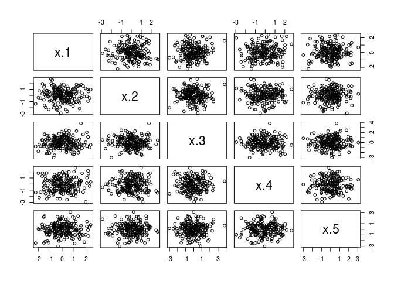
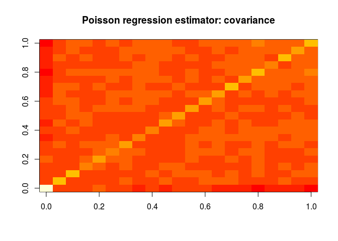
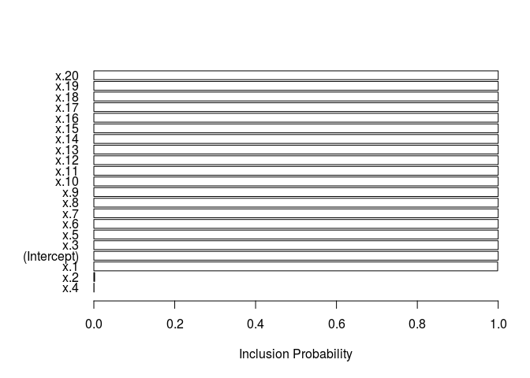
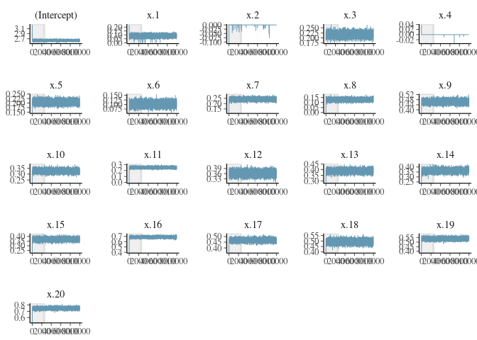

Exploration and Boom Spike-Slab package
================
Alex Cooper

``` r
dat <- read.csv('../simulated_data.csv')
```

Variance-covariance matrix of the data. It's pretty much diagonal!

``` r
X <- as.matrix(dat[,-1])
N <- nrow(X)
p <- ncol(X)
Sigma.hat <- 1/N * t(X) %*% X
image(Sigma.hat[p:1,], main='Data covariance matrix')
```

-1.png)

``` r
round(Sigma.hat[1:10, 1:10], 1)
```

    ##       x.1 x.2  x.3 x.4  x.5  x.6  x.7  x.8  x.9 x.10
    ## x.1   0.9 0.0  0.1 0.1  0.0 -0.1  0.0  0.0  0.0 -0.1
    ## x.2   0.0 1.0  0.0 0.0  0.1  0.0  0.0  0.0  0.0  0.0
    ## x.3   0.1 0.0  1.1 0.0  0.0  0.0  0.0  0.0  0.1 -0.1
    ## x.4   0.1 0.0  0.0 1.2  0.0  0.0  0.1  0.2  0.0  0.1
    ## x.5   0.0 0.1  0.0 0.0  1.1 -0.1  0.0  0.2  0.0  0.1
    ## x.6  -0.1 0.0  0.0 0.0 -0.1  1.0  0.1  0.1 -0.1  0.0
    ## x.7   0.0 0.0  0.0 0.1  0.0  0.1  1.0 -0.1  0.0  0.0
    ## x.8   0.0 0.0  0.0 0.2  0.2  0.1 -0.1  1.1 -0.1  0.1
    ## x.9   0.0 0.0  0.1 0.0  0.0 -0.1  0.0 -0.1  1.2 -0.1
    ## x.10 -0.1 0.0 -0.1 0.1  0.1  0.0  0.0  0.1 -0.1  1.1

``` r
pairs(X[,1:5])
```



Data are simulated using the following model:
$$ y\_i \\sim {\\rm Pois}\\left(\\Lambda(\\eta\_i)\\right), \\quad \\eta\_i = x\_i^\\top\\theta+\\varepsilon\_i.
$$

Basic frequentist GLM
---------------------

``` r
fit.all <- glm(y ~ ., data = dat, family = 'poisson')
summary(fit.all)
```

    ## 
    ## Call:
    ## glm(formula = y ~ ., family = "poisson", data = dat)
    ## 
    ## Deviance Residuals: 
    ##      Min        1Q    Median        3Q       Max  
    ## -11.0458   -2.6058   -0.8291    1.6123   17.3992  
    ## 
    ## Coefficients:
    ##             Estimate Std. Error z value Pr(>|z|)    
    ## (Intercept)  2.46266    0.02446 100.670  < 2e-16 ***
    ## x.1          0.14066    0.01433   9.812  < 2e-16 ***
    ## x.2          0.01552    0.01523   1.019    0.308    
    ## x.3          0.23815    0.01102  21.610  < 2e-16 ***
    ## x.4          0.06999    0.01353   5.171 2.33e-07 ***
    ## x.5          0.17330    0.01163  14.898  < 2e-16 ***
    ## x.6          0.15011    0.01246  12.045  < 2e-16 ***
    ## x.7          0.20230    0.01131  17.887  < 2e-16 ***
    ## x.8          0.12715    0.01143  11.124  < 2e-16 ***
    ## x.9          0.41607    0.01366  30.452  < 2e-16 ***
    ## x.10         0.28104    0.01355  20.738  < 2e-16 ***
    ## x.11         0.26978    0.01194  22.588  < 2e-16 ***
    ## x.12         0.38772    0.01238  31.326  < 2e-16 ***
    ## x.13         0.37207    0.01357  27.428  < 2e-16 ***
    ## x.14         0.35076    0.01558  22.509  < 2e-16 ***
    ## x.15         0.39975    0.01366  29.258  < 2e-16 ***
    ## x.16         0.69578    0.01427  48.746  < 2e-16 ***
    ## x.17         0.47515    0.01172  40.549  < 2e-16 ***
    ## x.18         0.55346    0.01545  35.831  < 2e-16 ***
    ## x.19         0.50963    0.01378  36.988  < 2e-16 ***
    ## x.20         0.72348    0.01562  46.320  < 2e-16 ***
    ## ---
    ## Signif. codes:  0 '***' 0.001 '**' 0.01 '*' 0.05 '.' 0.1 ' ' 1
    ## 
    ## (Dispersion parameter for poisson family taken to be 1)
    ## 
    ##     Null deviance: 18691.8  on 199  degrees of freedom
    ## Residual deviance:  3648.5  on 179  degrees of freedom
    ## AIC: 4506.9
    ## 
    ## Number of Fisher Scoring iterations: 5

``` r
image(vcov(fit.all), main = 'Poisson regression estimator: covariance')
```



``` r
# SparseM.image
```

Basic Bayesian GLM (normal priors)
----------------------------------

``` r
library(rstanarm)
```

    ## Loading required package: Rcpp

    ## rstanarm (Version 2.17.4, packaged: 2018-04-13 01:51:52 UTC)

    ## - Do not expect the default priors to remain the same in future rstanarm versions.

    ## Thus, R scripts should specify priors explicitly, even if they are just the defaults.

    ## - For execution on a local, multicore CPU with excess RAM we recommend calling

    ## options(mc.cores = parallel::detectCores())

    ## - Plotting theme set to bayesplot::theme_default().

``` r
fit.all <- stan_glm(y ~ ., data = dat, family = 'poisson',
                    
                    )
```

    ## 
    ## SAMPLING FOR MODEL 'count' NOW (CHAIN 1).
    ## 
    ## Gradient evaluation took 8.5e-05 seconds
    ## 1000 transitions using 10 leapfrog steps per transition would take 0.85 seconds.
    ## Adjust your expectations accordingly!
    ## 
    ## 
    ## Iteration:    1 / 2000 [  0%]  (Warmup)
    ## Iteration:  200 / 2000 [ 10%]  (Warmup)
    ## Iteration:  400 / 2000 [ 20%]  (Warmup)
    ## Iteration:  600 / 2000 [ 30%]  (Warmup)
    ## Iteration:  800 / 2000 [ 40%]  (Warmup)
    ## Iteration: 1000 / 2000 [ 50%]  (Warmup)
    ## Iteration: 1001 / 2000 [ 50%]  (Sampling)
    ## Iteration: 1200 / 2000 [ 60%]  (Sampling)
    ## Iteration: 1400 / 2000 [ 70%]  (Sampling)
    ## Iteration: 1600 / 2000 [ 80%]  (Sampling)
    ## Iteration: 1800 / 2000 [ 90%]  (Sampling)
    ## Iteration: 2000 / 2000 [100%]  (Sampling)
    ## 
    ##  Elapsed Time: 1.15841 seconds (Warm-up)
    ##                0.897053 seconds (Sampling)
    ##                2.05546 seconds (Total)
    ## 
    ## 
    ## SAMPLING FOR MODEL 'count' NOW (CHAIN 2).
    ## 
    ## Gradient evaluation took 5.8e-05 seconds
    ## 1000 transitions using 10 leapfrog steps per transition would take 0.58 seconds.
    ## Adjust your expectations accordingly!
    ## 
    ## 
    ## Iteration:    1 / 2000 [  0%]  (Warmup)
    ## Iteration:  200 / 2000 [ 10%]  (Warmup)
    ## Iteration:  400 / 2000 [ 20%]  (Warmup)
    ## Iteration:  600 / 2000 [ 30%]  (Warmup)
    ## Iteration:  800 / 2000 [ 40%]  (Warmup)
    ## Iteration: 1000 / 2000 [ 50%]  (Warmup)
    ## Iteration: 1001 / 2000 [ 50%]  (Sampling)
    ## Iteration: 1200 / 2000 [ 60%]  (Sampling)
    ## Iteration: 1400 / 2000 [ 70%]  (Sampling)
    ## Iteration: 1600 / 2000 [ 80%]  (Sampling)
    ## Iteration: 1800 / 2000 [ 90%]  (Sampling)
    ## Iteration: 2000 / 2000 [100%]  (Sampling)
    ## 
    ##  Elapsed Time: 1.09723 seconds (Warm-up)
    ##                0.878115 seconds (Sampling)
    ##                1.97535 seconds (Total)
    ## 
    ## 
    ## SAMPLING FOR MODEL 'count' NOW (CHAIN 3).
    ## 
    ## Gradient evaluation took 5.7e-05 seconds
    ## 1000 transitions using 10 leapfrog steps per transition would take 0.57 seconds.
    ## Adjust your expectations accordingly!
    ## 
    ## 
    ## Iteration:    1 / 2000 [  0%]  (Warmup)
    ## Iteration:  200 / 2000 [ 10%]  (Warmup)
    ## Iteration:  400 / 2000 [ 20%]  (Warmup)
    ## Iteration:  600 / 2000 [ 30%]  (Warmup)
    ## Iteration:  800 / 2000 [ 40%]  (Warmup)
    ## Iteration: 1000 / 2000 [ 50%]  (Warmup)
    ## Iteration: 1001 / 2000 [ 50%]  (Sampling)
    ## Iteration: 1200 / 2000 [ 60%]  (Sampling)
    ## Iteration: 1400 / 2000 [ 70%]  (Sampling)
    ## Iteration: 1600 / 2000 [ 80%]  (Sampling)
    ## Iteration: 1800 / 2000 [ 90%]  (Sampling)
    ## Iteration: 2000 / 2000 [100%]  (Sampling)
    ## 
    ##  Elapsed Time: 0.934908 seconds (Warm-up)
    ##                0.843397 seconds (Sampling)
    ##                1.77831 seconds (Total)
    ## 
    ## 
    ## SAMPLING FOR MODEL 'count' NOW (CHAIN 4).
    ## 
    ## Gradient evaluation took 5.6e-05 seconds
    ## 1000 transitions using 10 leapfrog steps per transition would take 0.56 seconds.
    ## Adjust your expectations accordingly!
    ## 
    ## 
    ## Iteration:    1 / 2000 [  0%]  (Warmup)
    ## Iteration:  200 / 2000 [ 10%]  (Warmup)
    ## Iteration:  400 / 2000 [ 20%]  (Warmup)
    ## Iteration:  600 / 2000 [ 30%]  (Warmup)
    ## Iteration:  800 / 2000 [ 40%]  (Warmup)
    ## Iteration: 1000 / 2000 [ 50%]  (Warmup)
    ## Iteration: 1001 / 2000 [ 50%]  (Sampling)
    ## Iteration: 1200 / 2000 [ 60%]  (Sampling)
    ## Iteration: 1400 / 2000 [ 70%]  (Sampling)
    ## Iteration: 1600 / 2000 [ 80%]  (Sampling)
    ## Iteration: 1800 / 2000 [ 90%]  (Sampling)
    ## Iteration: 2000 / 2000 [100%]  (Sampling)
    ## 
    ##  Elapsed Time: 1.21344 seconds (Warm-up)
    ##                0.900475 seconds (Sampling)
    ##                2.11392 seconds (Total)

``` r
summary(fit.all)
```

    ## 
    ## Model Info:
    ## 
    ##  function:     stan_glm
    ##  family:       poisson [log]
    ##  formula:      y ~ .
    ##  algorithm:    sampling
    ##  priors:       see help('prior_summary')
    ##  sample:       4000 (posterior sample size)
    ##  observations: 200
    ##  predictors:   21
    ## 
    ## Estimates:
    ##                 mean    sd      2.5%    25%     50%     75%     97.5%
    ## (Intercept)       2.5     0.0     2.4     2.4     2.5     2.5     2.5
    ## x.1               0.1     0.0     0.1     0.1     0.1     0.2     0.2
    ## x.2               0.0     0.0     0.0     0.0     0.0     0.0     0.0
    ## x.3               0.2     0.0     0.2     0.2     0.2     0.2     0.3
    ## x.4               0.1     0.0     0.0     0.1     0.1     0.1     0.1
    ## x.5               0.2     0.0     0.2     0.2     0.2     0.2     0.2
    ## x.6               0.2     0.0     0.1     0.1     0.2     0.2     0.2
    ## x.7               0.2     0.0     0.2     0.2     0.2     0.2     0.2
    ## x.8               0.1     0.0     0.1     0.1     0.1     0.1     0.1
    ## x.9               0.4     0.0     0.4     0.4     0.4     0.4     0.4
    ## x.10              0.3     0.0     0.3     0.3     0.3     0.3     0.3
    ## x.11              0.3     0.0     0.2     0.3     0.3     0.3     0.3
    ## x.12              0.4     0.0     0.4     0.4     0.4     0.4     0.4
    ## x.13              0.4     0.0     0.3     0.4     0.4     0.4     0.4
    ## x.14              0.4     0.0     0.3     0.3     0.4     0.4     0.4
    ## x.15              0.4     0.0     0.4     0.4     0.4     0.4     0.4
    ## x.16              0.7     0.0     0.7     0.7     0.7     0.7     0.7
    ## x.17              0.5     0.0     0.5     0.5     0.5     0.5     0.5
    ## x.18              0.6     0.0     0.5     0.5     0.6     0.6     0.6
    ## x.19              0.5     0.0     0.5     0.5     0.5     0.5     0.5
    ## x.20              0.7     0.0     0.7     0.7     0.7     0.7     0.8
    ## mean_PPD         40.1     0.6    38.8    39.6    40.1    40.5    41.3
    ## log-posterior -2264.8     3.2 -2271.9 -2266.7 -2264.4 -2262.4 -2259.5
    ## 
    ## Diagnostics:
    ##               mcse Rhat n_eff
    ## (Intercept)   0.0  1.0  2051 
    ## x.1           0.0  1.0  4000 
    ## x.2           0.0  1.0  4000 
    ## x.3           0.0  1.0  4000 
    ## x.4           0.0  1.0  4000 
    ## x.5           0.0  1.0  4000 
    ## x.6           0.0  1.0  4000 
    ## x.7           0.0  1.0  4000 
    ## x.8           0.0  1.0  4000 
    ## x.9           0.0  1.0  4000 
    ## x.10          0.0  1.0  4000 
    ## x.11          0.0  1.0  4000 
    ## x.12          0.0  1.0  4000 
    ## x.13          0.0  1.0  4000 
    ## x.14          0.0  1.0  4000 
    ## x.15          0.0  1.0  4000 
    ## x.16          0.0  1.0  2950 
    ## x.17          0.0  1.0  4000 
    ## x.18          0.0  1.0  4000 
    ## x.19          0.0  1.0  4000 
    ## x.20          0.0  1.0  4000 
    ## mean_PPD      0.0  1.0  4000 
    ## log-posterior 0.1  1.0  1513 
    ## 
    ## For each parameter, mcse is Monte Carlo standard error, n_eff is a crude measure of effective sample size, and Rhat is the potential scale reduction factor on split chains (at convergence Rhat=1).

The BoomSpikeSlab package implements a slab-and-spike poisson regression model.

``` r
library(BoomSpikeSlab)
```

    ## Loading required package: Boom

    ## Loading required package: MASS

    ## 
    ## Attaching package: 'Boom'

    ## The following object is masked from 'package:stats':
    ## 
    ##     rWishart

``` r
set.seed(123)
niter = 1e4
y <- dat[,'y']
X.design <- cbind(alpha=1, X)
prior <- SpikeSlabPrior(x=X.design, y=y,
                        expected.model.size = 0,
                        prior.inclusion.probabilities = rep(0.1, 21)
                        )
fit <- poisson.spike(y ~ ., data = dat, niter = niter,
                     prior = prior)
```

    ## =-=-=-=-= Iteration 0 Sat May  5 13:52:01 2018 =-=-=-=-=
    ## =-=-=-=-= Iteration 1000 Sat May  5 13:52:02 2018 =-=-=-=-=
    ## =-=-=-=-= Iteration 2000 Sat May  5 13:52:03 2018 =-=-=-=-=
    ## =-=-=-=-= Iteration 3000 Sat May  5 13:52:05 2018 =-=-=-=-=
    ## =-=-=-=-= Iteration 4000 Sat May  5 13:52:06 2018 =-=-=-=-=
    ## =-=-=-=-= Iteration 5000 Sat May  5 13:52:07 2018 =-=-=-=-=
    ## =-=-=-=-= Iteration 6000 Sat May  5 13:52:08 2018 =-=-=-=-=
    ## =-=-=-=-= Iteration 7000 Sat May  5 13:52:09 2018 =-=-=-=-=
    ## =-=-=-=-= Iteration 8000 Sat May  5 13:52:10 2018 =-=-=-=-=
    ## =-=-=-=-= Iteration 9000 Sat May  5 13:52:11 2018 =-=-=-=-=

``` r
summary(fit)
```

    ##                Length Class          Mode   
    ## beta           210000 -none-         numeric
    ## prior               7 SpikeSlabPrior list   
    ## log.likelihood  10000 -none-         numeric
    ## xlevels             0 -none-         list   
    ## call                5 -none-         call   
    ## terms               3 terms          call   
    ## training.data      21 data.frame     list

``` r
plot(fit)
```



``` r
library(coda)
```

    ## 
    ## Attaching package: 'coda'

    ## The following object is masked from 'package:Boom':
    ## 
    ##     thin

``` r
fit.coda <- mcmc(fit$beta)
summary(fit.coda)
```

    ## 
    ## Iterations = 1:10000
    ## Thinning interval = 1 
    ## Number of chains = 1 
    ## Sample size per chain = 10000 
    ## 
    ## 1. Empirical mean and standard deviation for each variable,
    ##    plus standard error of the mean:
    ## 
    ##                   Mean        SD  Naive SE Time-series SE
    ## (Intercept)  2.639e+00 0.0242850 2.429e-04      4.200e-04
    ## x.1          8.825e-02 0.0163571 1.636e-04      2.410e-04
    ## x.2         -9.048e-05 0.0022389 2.239e-05      3.455e-05
    ## x.3          2.165e-01 0.0112166 1.122e-04      1.449e-04
    ## x.4         -2.019e-06 0.0005207 5.207e-06      5.207e-06
    ## x.5          2.056e-01 0.0106859 1.069e-04      1.392e-04
    ## x.6          1.031e-01 0.0126120 1.261e-04      1.813e-04
    ## x.7          2.417e-01 0.0116030 1.160e-04      1.581e-04
    ## x.8          1.285e-01 0.0124330 1.243e-04      1.748e-04
    ## x.9          4.635e-01 0.0137946 1.379e-04      1.998e-04
    ## x.10         3.276e-01 0.0140900 1.409e-04      2.018e-04
    ## x.11         2.516e-01 0.0129247 1.292e-04      1.844e-04
    ## x.12         3.616e-01 0.0133178 1.332e-04      1.818e-04
    ## x.13         3.880e-01 0.0156038 1.560e-04      2.274e-04
    ## x.14         3.624e-01 0.0174215 1.742e-04      2.662e-04
    ## x.15         3.696e-01 0.0153727 1.537e-04      2.325e-04
    ## x.16         6.866e-01 0.0145327 1.453e-04      2.212e-04
    ## x.17         4.676e-01 0.0128178 1.282e-04      1.800e-04
    ## x.18         4.935e-01 0.0175026 1.750e-04      2.772e-04
    ## x.19         5.371e-01 0.0134563 1.346e-04      1.932e-04
    ## x.20         7.485e-01 0.0164420 1.644e-04      2.466e-04
    ## 
    ## 2. Quantiles for each variable:
    ## 
    ##                2.5%     25%     50%     75%  97.5%
    ## (Intercept) 2.59199 2.62313 2.63854 2.65422 2.6834
    ## x.1         0.05650 0.07748 0.08848 0.09916 0.1196
    ## x.2         0.00000 0.00000 0.00000 0.00000 0.0000
    ## x.3         0.19492 0.20886 0.21646 0.22411 0.2388
    ## x.4         0.00000 0.00000 0.00000 0.00000 0.0000
    ## x.5         0.18438 0.19844 0.20556 0.21298 0.2265
    ## x.6         0.07832 0.09456 0.10330 0.11169 0.1277
    ## x.7         0.21889 0.23390 0.24183 0.24952 0.2643
    ## x.8         0.10459 0.12012 0.12845 0.13690 0.1528
    ## x.9         0.43659 0.45420 0.46336 0.47277 0.4903
    ## x.10        0.30038 0.31797 0.32770 0.33734 0.3549
    ## x.11        0.22665 0.24325 0.25155 0.26002 0.2762
    ## x.12        0.33599 0.35259 0.36153 0.37058 0.3878
    ## x.13        0.35758 0.37750 0.38798 0.39865 0.4188
    ## x.14        0.32908 0.35054 0.36231 0.37423 0.3957
    ## x.15        0.33941 0.35940 0.36952 0.37999 0.3996
    ## x.16        0.65914 0.67708 0.68653 0.69616 0.7146
    ## x.17        0.44264 0.45917 0.46758 0.47622 0.4930
    ## x.18        0.45891 0.48167 0.49360 0.50522 0.5278
    ## x.19        0.51065 0.52806 0.53703 0.54626 0.5631
    ## x.20        0.71638 0.73743 0.74852 0.75960 0.7803

``` r
coda::effectiveSize(fit.coda)
```

    ## (Intercept)         x.1         x.2         x.3         x.4         x.5 
    ##    3342.743    4605.861    4200.108    5988.884   10000.000    5891.613 
    ##         x.6         x.7         x.8         x.9        x.10        x.11 
    ##    4838.224    5386.951    5061.280    4768.566    4872.773    4913.037 
    ##        x.12        x.13        x.14        x.15        x.16        x.17 
    ##    5364.249    4709.818    4282.894    4373.487    4315.257    5072.895 
    ##        x.18        x.19        x.20 
    ##    3985.993    4850.353    4444.531

``` r
library(coda)
fit.ss <- mcmc(fit$beta, start = niter/4)
summary(fit.ss)
```

    ## 
    ## Iterations = 2500:12499
    ## Thinning interval = 1 
    ## Number of chains = 1 
    ## Sample size per chain = 10000 
    ## 
    ## 1. Empirical mean and standard deviation for each variable,
    ##    plus standard error of the mean:
    ## 
    ##                   Mean        SD  Naive SE Time-series SE
    ## (Intercept)  2.639e+00 0.0242850 2.429e-04      4.200e-04
    ## x.1          8.825e-02 0.0163571 1.636e-04      2.410e-04
    ## x.2         -9.048e-05 0.0022389 2.239e-05      3.455e-05
    ## x.3          2.165e-01 0.0112166 1.122e-04      1.449e-04
    ## x.4         -2.019e-06 0.0005207 5.207e-06      5.207e-06
    ## x.5          2.056e-01 0.0106859 1.069e-04      1.392e-04
    ## x.6          1.031e-01 0.0126120 1.261e-04      1.813e-04
    ## x.7          2.417e-01 0.0116030 1.160e-04      1.581e-04
    ## x.8          1.285e-01 0.0124330 1.243e-04      1.748e-04
    ## x.9          4.635e-01 0.0137946 1.379e-04      1.998e-04
    ## x.10         3.276e-01 0.0140900 1.409e-04      2.018e-04
    ## x.11         2.516e-01 0.0129247 1.292e-04      1.844e-04
    ## x.12         3.616e-01 0.0133178 1.332e-04      1.818e-04
    ## x.13         3.880e-01 0.0156038 1.560e-04      2.274e-04
    ## x.14         3.624e-01 0.0174215 1.742e-04      2.662e-04
    ## x.15         3.696e-01 0.0153727 1.537e-04      2.325e-04
    ## x.16         6.866e-01 0.0145327 1.453e-04      2.212e-04
    ## x.17         4.676e-01 0.0128178 1.282e-04      1.800e-04
    ## x.18         4.935e-01 0.0175026 1.750e-04      2.772e-04
    ## x.19         5.371e-01 0.0134563 1.346e-04      1.932e-04
    ## x.20         7.485e-01 0.0164420 1.644e-04      2.466e-04
    ## 
    ## 2. Quantiles for each variable:
    ## 
    ##                2.5%     25%     50%     75%  97.5%
    ## (Intercept) 2.59199 2.62313 2.63854 2.65422 2.6834
    ## x.1         0.05650 0.07748 0.08848 0.09916 0.1196
    ## x.2         0.00000 0.00000 0.00000 0.00000 0.0000
    ## x.3         0.19492 0.20886 0.21646 0.22411 0.2388
    ## x.4         0.00000 0.00000 0.00000 0.00000 0.0000
    ## x.5         0.18438 0.19844 0.20556 0.21298 0.2265
    ## x.6         0.07832 0.09456 0.10330 0.11169 0.1277
    ## x.7         0.21889 0.23390 0.24183 0.24952 0.2643
    ## x.8         0.10459 0.12012 0.12845 0.13690 0.1528
    ## x.9         0.43659 0.45420 0.46336 0.47277 0.4903
    ## x.10        0.30038 0.31797 0.32770 0.33734 0.3549
    ## x.11        0.22665 0.24325 0.25155 0.26002 0.2762
    ## x.12        0.33599 0.35259 0.36153 0.37058 0.3878
    ## x.13        0.35758 0.37750 0.38798 0.39865 0.4188
    ## x.14        0.32908 0.35054 0.36231 0.37423 0.3957
    ## x.15        0.33941 0.35940 0.36952 0.37999 0.3996
    ## x.16        0.65914 0.67708 0.68653 0.69616 0.7146
    ## x.17        0.44264 0.45917 0.46758 0.47622 0.4930
    ## x.18        0.45891 0.48167 0.49360 0.50522 0.5278
    ## x.19        0.51065 0.52806 0.53703 0.54626 0.5631
    ## x.20        0.71638 0.73743 0.74852 0.75960 0.7803

``` r
bayesplot::mcmc_trace(fit$beta, n_warmup = niter/4)
```


