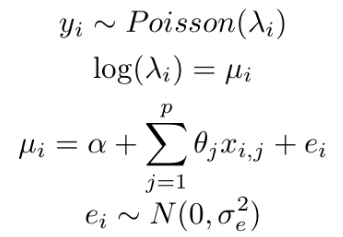
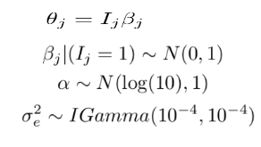
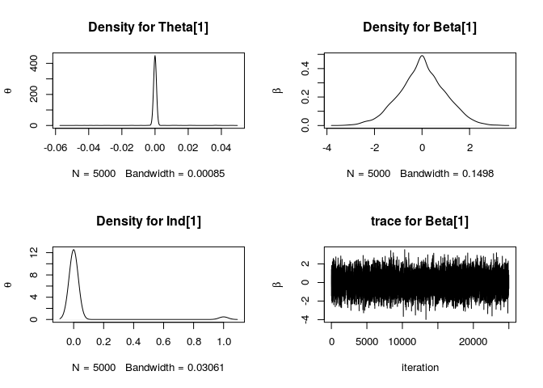
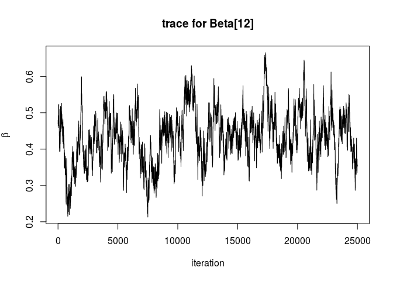

Bayes on the Beach Workshop 2017
================================

Workshop Aims:
--------------

-   Review some Bayesian Variable Selection methods (O’Hara and Sillanpaa sugested material)
-   Some coding in R (Visualisation | Coding | Methods)
-   Analysis of a simple model with variable selection.

The task
--------

### Data Model:



R code for simulation from data model (O’Hara and Sillanpaa):

``` r
set.seed(1)
## Data for the simulations see description under eq (2):

n <- 200; p <- 20
alpha <- log(10)
sig_e <- 0.75

x <- matrix(  rnorm(n = n*p, mean = 0, sd = 1), 
              nrow = n, ncol = p)

e <- rnorm(n = n, mean = 0, sd = sig_e)
theta <- 0.3 + 0.3*(1:20/10.5 - 1)

## Simulate for this dataset
mu <- alpha + x%*%theta + e
lambda <- exp(mu)
y <- rpois(n, lambda)

dataset <- data.frame(y=y, x=x)
#write.csv(x = dataset, file = "simulated_data.csv", row.names = F)
```

The regression parameters *θ*<sub>*j*</sub> have a mean of 0.3, rough range (0, 0.6). While not exact zeros, the aim is to investigate the inference (eg probability of inclusion) and sparse estiamtion in Bayesian framework.

``` r
#plot(1:length(theta), theta, xlab = "Regression parameter", ylab = "Theta")
```

### Modelling

Priors for the model (eq. 3, 4 of O’Hara and Sillanpaa) 

Methods implemented in Bugs were provided in supplment for the original paper. See [supplement.html](supplement.html).

Example solution
----------------

The most direct approach to variable selection is to set the slab, *θ*<sub>*j*</sub>|(*I*<sub>*j*</sub> = 1) equal to *β*<sub>*j*</sub> and spike *θ*<sub>*j*</sub>|(*I*<sub>*j*</sub> = 0) equal to zero. A simple example solution using the Kuo and Mallick method sets *θ*<sub>*j*</sub> = *I*<sub>*j*</sub>*β*<sub>*j*</sub> which assumes independance *P*(*I*<sub>*j*</sub>, *β*<sub>*j*</sub>)=*P*(*I*<sub>*j*</sub>)*P*(*β*<sub>*j*</sub>).

Using the package nible:

``` r
library(nimble)
dataset <- read.csv("simulated_data.csv")
n <- 200; p <- 20
y <- dataset[,1]
x <- as.matrix(dataset[,-1])

# Set MCMC parameters
M.burnin <- 10000
M <- 5000
n.thin <- 5

myBUGScode <- nimbleCode({
  Pind <- 0.5
  alpha ~ dnorm(log(10),1)             # Intercept 
  tau ~ dgamma(1.0E-4,1.0E-4)          # precision param
  for(j in 1:p) {
    Ind[j] ~ dbern(Pind)               # Indicator
    beta[j] ~ dnorm(0,1)               # Conditional Regression coefficient
    theta[j] <- Ind[j]*beta[j]
  }
  for(i in 1:n) {
    er[i] ~ dnorm(0, tau)
    mu[i] <- alpha + inprod(theta[], X[i,]) + er[i]
    lambda[i] <- exp(mu[i])
    y[i] ~ dpois(lambda[i])          # Likelihood 
  }
})
```

For nimble, define the constants and dimensions, parse in model.

``` r
constants <- list(n = n, p=p)
dimensions = list(beta = p,
                  theta = p,
                  Ind =  p,
                  lambda =  n,
                  X = c(n,p),
                  er = n,
                  mu = n)
myModel <- nimbleModel(myBUGScode, 
                       constants = constants, 
                       dimensions = dimensions)
```

Give the model the data, inital values and build the MCMC.

``` r
myModel$setData(
  list(y = dataset[,1], X = as.matrix(dataset[,-1]))
  )

myModel$setInits(
  list(alpha=1, tau = 0.5, beta = matrix(0,nrow = 1, ncol = p), er = rnorm(n,0,1))
  )

myMCMC <- buildMCMC(myModel)
```

Using Nible, compute the mcmc and plot the thinned samples:

``` r
compiled <- compileNimble(myModel, myMCMC)

compiled$myMCMC$run(M.burnin + M*n.thin)
```

    ## |-------------|-------------|-------------|-------------|
    ## |-------------------------------------------------------|

    ## NULL

``` r
samples <- as.matrix(compiled$myMCMC$mvSamples)

thinnedsample <- samples[M.burnin + seq(from = 1,by = n.thin, 
                             to = M*n.thin),]
```

### Plots and analysis

Plot Density of coeffieicnts for *θ*<sub>1</sub> values.

``` r
par(mfrow=c(2,2))
plot(density(thinnedsample[,"beta[1]"]*thinnedsample[,"Ind[1]"]), ylab = expression(theta), main = "Density for Theta[1]")
plot(density(thinnedsample[,"beta[1]"]), ylab = expression(beta), main = "Density for Beta[1]")
plot(density(thinnedsample[,"Ind[1]"]), ylab = expression(theta), main = "Density for Ind[1]")
plot(samples[-c(1:M.burnin),"beta[1]"],  type = 'l', xlab = 'iteration',  ylab = expression(beta), main = "trace for Beta[1]")
```



``` r
par(mfrow=c(1,1))
```

The *θ*<sub>1</sub> parameter is strongly consentrated at zero, traceplots for beta show convergence for the betat parameter and density for *I*<sub>1</sub> also indicate evidence that this variable does not contribute much to the regression. The true value for *θ*<sub>1</sub> = 0.02857143 which is very small, the posterior mean estimate is 3.710^{-5}.

Traceplots show some potential issues for parameters, eg *θ*<sub>12</sub> with trace plot:

``` r
plot(samples[-c(1:M.burnin),"beta[12]"],  type = 'l', xlab = 'iteration',  ylab = expression(beta), main = "trace for Beta[12]")
```



Using the skimr package to see posterior summary results:

    ## 
    ## Attaching package: 'skimr'

    ## The following object is masked from 'package:knitr':
    ## 
    ##     kable

    ## Skim summary statistics  
    ##  n obs: 5000    
    ##  n variables: 40    
    ## 
    ## Variable type: numeric
    ## 
    ## variable   n      mean       sd        p0        p25      p50     p75      p100     hist     
    ## ---------  -----  ---------  --------  --------  -------  ------  -------  -------  ---------
    ## beta_01    5000   3.69e-05   0.00519   -0.0548   0        0       0        0.0471   ▁▁▁▁▇▁▁▁ 
    ## beta_02    5000   0.0147     0.0424    -0.0448   0        0       0        0.222    ▁▇▁▁▁▁▁▁ 
    ## beta_03    5000   0.0564     0.0706    -0.0365   0        0       0.114    0.229    ▁▇▁▂▁▁▁▁ 
    ## beta_04    5000   0.000422   0.00903   -0.0547   0        0       0        0.0655   ▁▁▁▇▁▁▁▁ 
    ## beta_05    5000   0.00275    0.0124    -0.0373   0        0       0        0.0574   ▁▁▁▇▁▁▁▁ 
    ## beta_06    5000   0.119      0.108     -0.0544   0        0.137   0.215    0.375    ▁▇▁▂▃▃▁▁ 
    ## beta_07    5000   0.0518     0.0862    -0.0255   0        0       0.0883   0.323    ▇▁▁▁▁▁▁▁ 
    ## beta_08    5000   0.206      0.122     -0.0208   0.0933   0.241   0.296    0.48     ▅▂▁▅▇▆▂▁ 
    ## beta_09    5000   0.252      0.0744    0         0.212    0.26    0.305    0.472    ▁▁▂▆▇▆▁▁ 
    ## beta_10    5000   0.352      0.0668    0.13      0.305    0.352   0.397    0.555    ▁▁▃▇▇▅▂▁ 
    ## beta_11    5000   0.382      0.0648    0.175     0.34     0.38    0.424    0.634    ▁▂▅▇▆▂▁▁ 
    ## beta_12    5000   0.434      0.0708    0.215     0.389    0.434   0.479    0.666    ▁▁▅▇▇▃▁▁ 
    ## beta_13    5000   0.401      0.0726    0.15      0.357    0.4     0.444    0.642    ▁▁▃▇▇▃▁▁ 
    ## beta_14    5000   0.378      0.0772    0.109     0.329    0.38    0.429    0.655    ▁▁▃▇▇▃▁▁ 
    ## beta_15    5000   0.405      0.0668    0.222     0.358    0.406   0.452    0.602    ▁▂▆▇▇▅▂▁ 
    ## beta_16    5000   0.489      0.0693    0.265     0.443    0.49    0.536    0.713    ▁▁▅▇▇▅▁▁ 
    ## beta_17    5000   0.509      0.0691    0.268     0.462    0.51    0.554    0.752    ▁▁▃▇▇▃▁▁ 
    ## beta_18    5000   0.51       0.0749    0.273     0.46     0.511   0.558    0.749    ▁▁▅▇▇▃▁▁ 
    ## beta_19    5000   0.527      0.0642    0.318     0.481    0.525   0.572    0.748    ▁▁▅▇▇▅▁▁ 
    ## beta_20    5000   0.475      0.0749    0.202     0.423    0.476   0.53     0.695    ▁▁▃▆▇▆▂▁ 
    ## Ind_01     5000   0.0362     0.187     0         0        0       0        1        ▇▁▁▁▁▁▁▁ 
    ## Ind_02     5000   0.144      0.351     0         0        0       0        1        ▇▁▁▁▁▁▁▂ 
    ## Ind_03     5000   0.461      0.499     0         0        0       1        1        ▇▁▁▁▁▁▁▇ 
    ## Ind_04     5000   0.0648     0.246     0         0        0       0        1        ▇▁▁▁▁▁▁▁ 
    ## Ind_05     5000   0.096      0.295     0         0        0       0        1        ▇▁▁▁▁▁▁▁ 
    ## Ind_06     5000   0.618      0.486     0         0        1       1        1        ▅▁▁▁▁▁▁▇ 
    ## Ind_07     5000   0.344      0.475     0         0        0       1        1        ▇▁▁▁▁▁▁▅ 
    ## Ind_08     5000   0.839      0.367     0         1        1       1        1        ▂▁▁▁▁▁▁▇ 
    ## Ind_09     5000   0.988      0.109     0         1        1       1        1        ▁▁▁▁▁▁▁▇ 
    ## Ind_10     5000   1          0         1         1        1       1        1        ▁▁▁▇▁▁▁▁ 
    ## Ind_11     5000   1          0         1         1        1       1        1        ▁▁▁▇▁▁▁▁ 
    ## Ind_12     5000   1          0         1         1        1       1        1        ▁▁▁▇▁▁▁▁ 
    ## Ind_13     5000   1          0         1         1        1       1        1        ▁▁▁▇▁▁▁▁ 
    ## Ind_14     5000   1          0         1         1        1       1        1        ▁▁▁▇▁▁▁▁ 
    ## Ind_15     5000   1          0         1         1        1       1        1        ▁▁▁▇▁▁▁▁ 
    ## Ind_16     5000   1          0         1         1        1       1        1        ▁▁▁▇▁▁▁▁ 
    ## Ind_17     5000   1          0         1         1        1       1        1        ▁▁▁▇▁▁▁▁ 
    ## Ind_18     5000   1          0         1         1        1       1        1        ▁▁▁▇▁▁▁▁ 
    ## Ind_19     5000   1          0         1         1        1       1        1        ▁▁▁▇▁▁▁▁ 
    ## Ind_20     5000   1          0         1         1        1       1        1        ▁▁▁▇▁▁▁▁

Conserns
--------

-   Results for the variable selection are not stable using the Kuo and Mallick method (also reported in O’Hara and Sillanpaa). Need a better method for variable selection.
-   Very simple method but appears to perform poorly on this dataset.
-   Additional graphical exploration would provide further insight.
